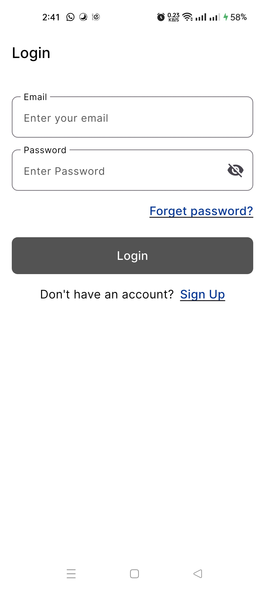
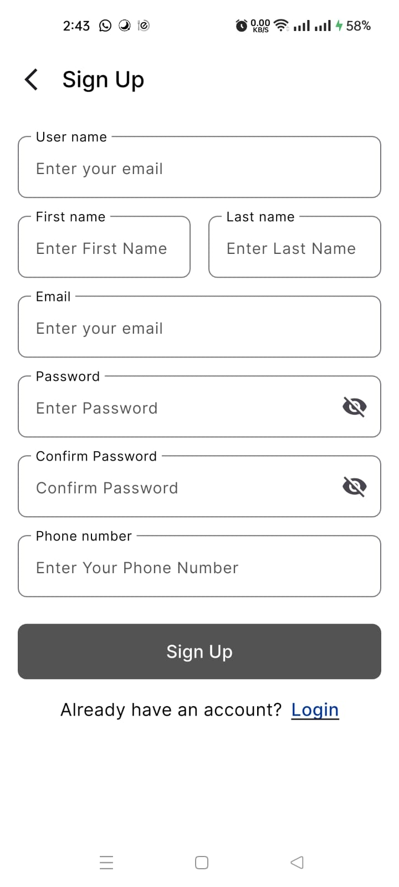
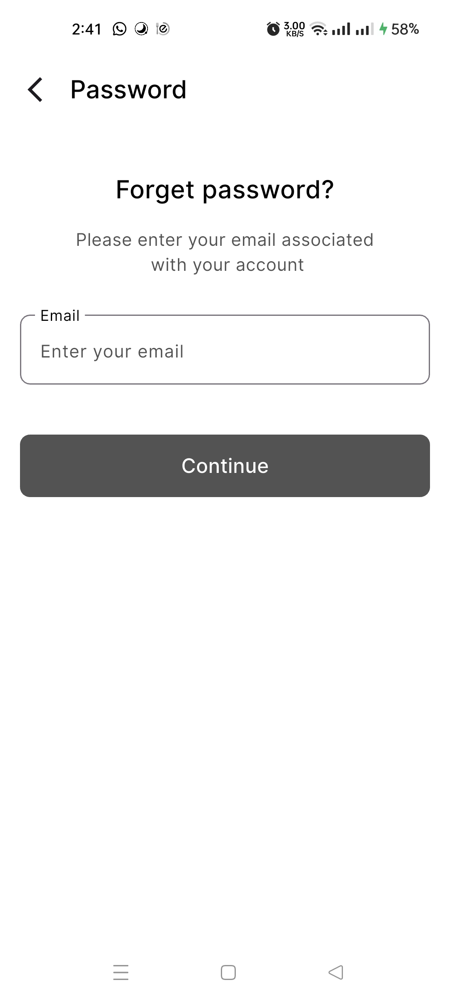
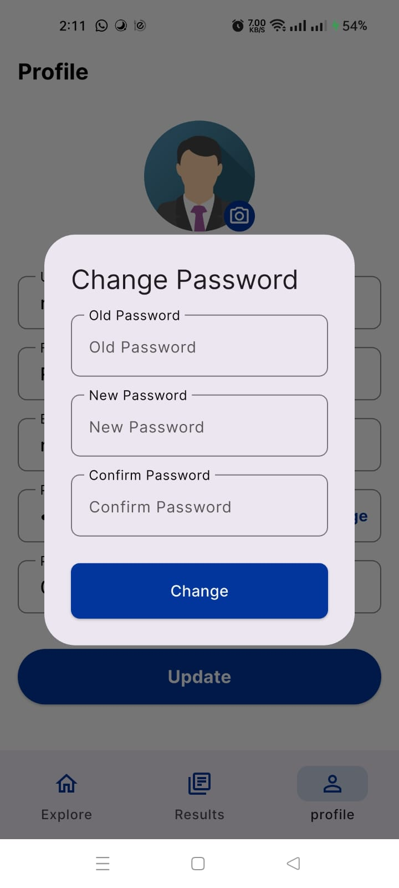
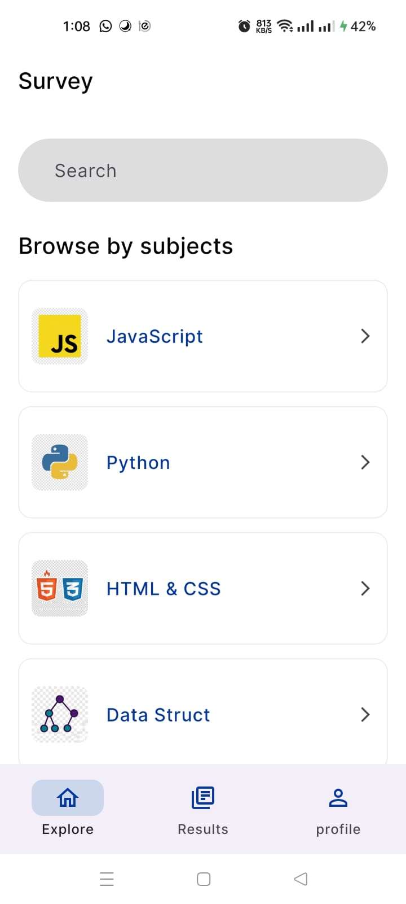
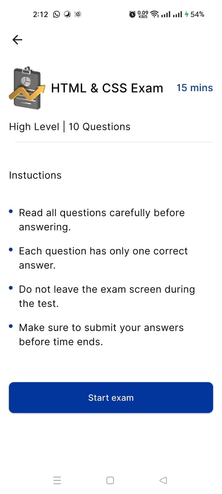
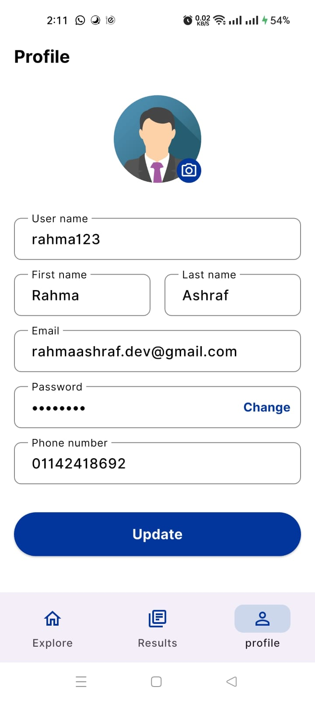
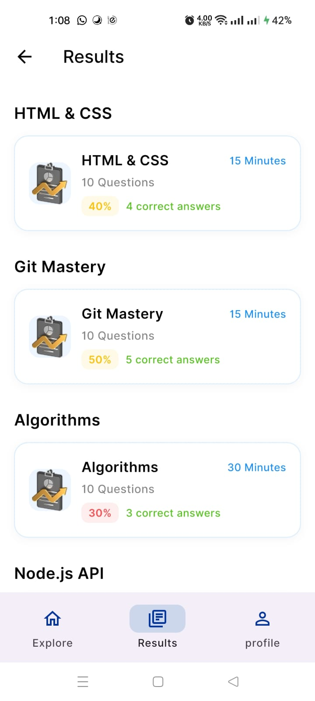
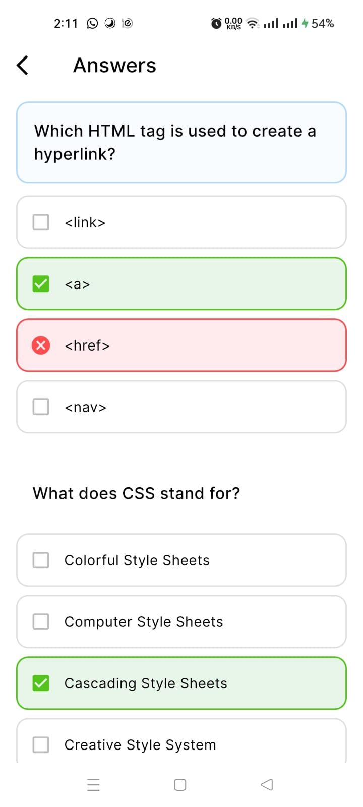

# 🎓 Online Exam App

## 💻 Overview  
Online Exam App is a Flutter application for taking and managing online exams with a smooth, secure, and responsive experience. It follows Clean Architecture and uses Bloc/Cubit for scalable state management.

---

## 🏗️ Architecture  
Presentation: UI, screens, Cubits  
Domain: business logic, entities, use cases  
Data: APIs, models, repositories  
Core: shared services, networking, utilities  

---

## ✨ Features  
Authentication (login, register, OTP, reset password)  
Take exams with timer-based questions  
View results and answer review  
Exam history tracking  
Arabic & English support (RTL ready)  

---

## 🛠️ Tech Stack  
Flutter Dart CleanArchitecture BLoC Cubit Firebase RESTAPI Dio Retrofit Localization DependencyInjection  

---

## 🚀 Getting Started  
git clone <repo-url>  
flutter pub get  
dart run build_runner build --delete-conflicting-outputs  
flutter run  

---

## 🧪 Testing  
flutter test

# Auth

  
  
  
  

# Subjects

  

# Exam

  
  

# Profile

  

# Results & Answers

  
  

